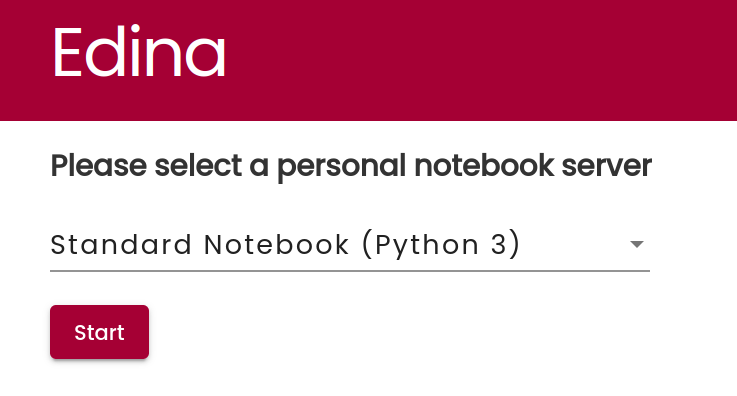
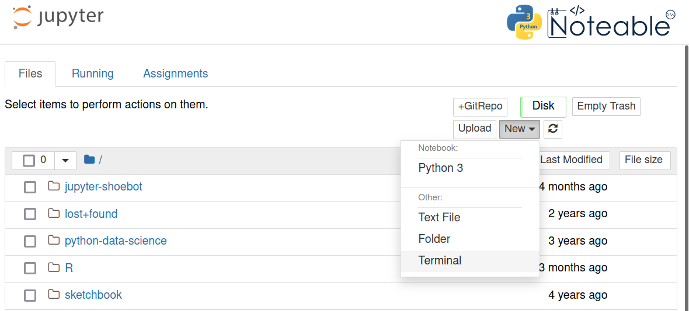

Alternative Python Setup
========================

.. warning::

    Please ignore this bit if you downloaded and ran Thonny, and move on to :ref:`the next section <simple_drawing>`!

.. _noteable_login:

Noteable
--------

If Thonny doesn't work for you, please log in to this site using EASE:

`https://noteable.edina.ac.uk/login <https://noteable.edina.ac.uk/login>`_

You'll see something like this:

Click "Start". You'll see a page with buttons for "Reconnect" and "Shut Down".
If you get stuck there click "Reconnect", but usually it will connect on its own.

Now you'll see something like this. Your page likely won't have any files or folders
yet, as you haven't written any code!

Unfortunately there's a bit of setup that will be required most times when you log in.
As shown in the image, click on "New" and then "Terminal". On this page there will be
a black rectangle with light grey text, something like:

.. code::

    jovyan@jupyter-3e7qpw2snn6gqwznvouvqr-64686cbbc8-rm9xb:~$

In the terminal type in:

.. code::

    pip -q install mobilechelonian

and press Enter. You should see a repetition of the prompt text above (ending in $).
If there are any other messages ask a tutor for help! Now close that tab and go back to
the other one (with the Noteable logo in the top right corner).

.. _python_and_editor:

Python and a text editor
------------------------

You could also try downloading
`Visual Studio Code`_ (again available
for Windows, OS X or Linux) or another text editor, and separately `Python for Windows`_ 
or `Python for OS X`_. (If you're using Linux the chances are that there's already an up
to date Python on your computer).
You'll need to do some work to get Python and your text editor to talk to each
other though -- ask a tutor about this.

.. _Visual Studio Code: https://code.visualstudio.com/Download
.. _Python for Windows: https://www.python.org/ftp/python/3.9.7/python-3.9.7-amd64.exe
.. _Python for OS X: https://www.python.org/ftp/python/3.9.7/python-3.9.7-macosx10.9.pkg

.. tip::

   Wordpad, TextEdit, Notepad, and Word are **not** suitable code editors.
