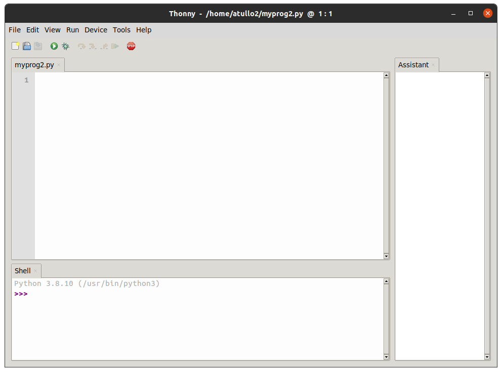

.. |thonny| raw:: html

    Thonny

.. |noteable| raw:: html

    Noteable

Getting started
***************

Welcome!
========

This is an informal session to build confidence in programming, using
the Python programming language and turtle graphics. It's a training
course, so there's no assessment, and no course credit!

I assume that participants have no programming experience at all. While
I will talk through the materials, the course is focused on practical
exercises. Questions are always welcome at any time

How to use this course
======================

If you get stuck with the exercises, feel free to ask for help from a
tutor. You can also help each other‒it would be great if you could
introduce yourself to the people at your table and talk about the
exercises! Of course, it's ok to work on your own, if that's what you
prefer.

You can also read ahead and try the next exercise if that helps. If you've
finished the exercises you can always move on to the next one.

Computer programming and failure
================================

Computer programming involves lots of failure‒often you have to fail
several times to succeed once, editing the code until it works! This is
ok and happens to everyone, even very experienced programmers. As we'll
see later, most of
the time there will be an error message, which will give you a clue to
the solution for the problem.

What you'll need
================

A Python!
---------

You can follow this course using (almost) any copy of Python and something that can
edit Python code. That said, there
is a Python environment called Thonny which is specially designed for beginners,
and that's what I recommend for this course:

| `Thonny for Microsoft Windows`_
| `Thonny for Mac OS X`_
| `Thonny for Linux`_

.. _Thonny for Microsoft Windows: https://github.com/thonny/thonny/releases/download/v3.3.13/thonny-3.3.13.exe
.. _Thonny for Mac OS X: https://github.com/thonny/thonny/releases/download/v3.3.13/thonny-3.3.13.pkg
.. _Thonny for Linux: https://github.com/thonny/thonny/wiki/Linux

Once you've installed this start it up. You should see something like this:

If that doesn't work for you, please first try
:ref:`logging on to Noteable <noteable_login>` .
If *that* doesn't work, please try
:ref:`a text editor and Python install <python_and_editor>` .

Throughout the rest of the course, where something differs
between |thonny| and |noteable|, I'll make this clear with colour-coded boxes.
You only need to follow the instructions for the one you're using!

The instructions for Noteable will sometimes be hidden‒if this is the case just click
"Show" to see them.

What is Python, exactly?
========================

If you're doing preparation for the class you can stop reading now! We'll go through
the rest in the class. (Feel free to keep reading if you're interested, of course ☺).

Python is a **programming language**. You've probably heard this term before, but what
does it mean? It means that Python takes text that 
you've written (called **code**), turns it into instructions for 
your computer, and runs those instructions. We'll be learning how to write code 
to do cool and useful stuff. No longer will you be restricted to using other people's 
programs to do things with your computer - you can make your own!

Failure
=======

Using Python
============

To start with we'll use Python as a **command-line interpreter** (you might also see
this referred to as a **REPL**). This takes text commands and runs 
them as you enter them, which is very handy for trying things out.

.. container:: thonny

    In Thonny just type your commands into the panel titled "Shell" at
    the bottom of the window.

Click "Show" to see how to do this in Noteable.

.. container:: solution

    .. container:: noteable

        Go back to your Noteable home page, click New → Python 3.
        A new tab will appear looking like this:

        .. image:: images/notebook.png

        Click on the box after ``In: [ ]``. You'll be able to type your code in there. Unlike
        in Thonny, you will have to press :kbd:`Shift-Enter` to run each line of code.

Interacting With Python
-----------------------

You can now enter some code for python to run. Try::

    print("Hello world")

Press :kbd:`Enter` and see what happens. After showing the results, Python 
will bring you back to the interactive prompt, where you could enter 
another command:

    >>> print("Hello world")
    Hello world
    >>> (1 + 4) * 2
    10

An extremely useful command is ``help()``, which enters a help functionality 
to explore all the stuff python lets you do, right from the interpreter.
Press :kbd:`q` to close the help window and return to the Python prompt.

Exercise
--------

Just above we demonstrated entering a command to figure out some math. Try 
some maths commands of your own! What operations does python know? Get it 
to add 239 and 588 together, and then square the result.

.. rst-class:: solution

Solution
--------

Here are some ways you might have got the answer:

    >>> 239 + 588
    827
    >>> 827 * 827
    683929

    >>> (239 + 588) * (239 + 588)
    683929

    >>> (239 + 588) ** 2
    683929

Running Python files
--------------------

When you have a lot of python code to run, you will want to save it into 
a file, so for instance, you can modify small parts of it (fix a bug) and 
re-run the code without having to repeatedly re-type the rest. 
Instead of typing commands in one-by-one you can save your code to a 
file and run it all at once.

.. container:: thonny

    In **Thonny**: Type your code into the panel at the top of the window:

    .. image:: images/thonny_code.png

    You can then use File → Save As .... to decide where to save your file.

    Click on the green circle with an arrow in it |thonny_run| to run your
    program.

.. container:: noteable

    In **Noteable**: You can type multiple lines of code together (using Enter at
    the end of each line) then press Shift-Enter to run them all together.

    Try this for a simple program with more than one line of code, maybe

.. code::

    print("Hello world")
    print("something else")

And now we are all set and can get started with turtle!

.. warning::

   When playing around with turtle in the following sections, avoid naming your file :file:`turtle.py` 
   --- rather use more appropriate names such as :file:`square.py` or 
   :file:`rectangle.py`.  Otherwise, whenever you refer to ``turtle``, Python 
   will pick up *your* file instead of the standard Python turtle module.

