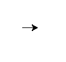

.. _simple_drawing:

Simple drawing with turtle
**************************

Introduction
============

"Turtle" is a python feature like a drawing board, which lets you command
a turtle to draw all over it!

You can use functions like ``turtle.forward(...)`` and ``turtle.left(...)``
which can move the turtle around.

Before you can use turtle, you have to import it. We recommend playing around
with it in the interactive interpreter first, as there is an extra bit of work
required to make it work from files.

.. container:: thonny

    To start it up in **Thonny** type::

        import turtle

    You should see something like this (but if you don't see below):

    .. image:: images/default.png

For Noteable instructions click "Show".

.. rst-class:: solution

    .. container:: noteable

        To start it up in **Noteable**, type::

            from mobilechelonian import Turtle; turtle=Turtle()

        You'll see this:

        .. image:: images/chelonian_start.png

On some computers nothing appears until you get to the next step, so
don't worry if you don't see a result yet!

.. note::
   
   While it might be tempting to just copy and paste what's written on
   this page into your terminal, we encourage you to type out each command.
   Typing gets the syntax of Python "under your fingers"
   and can help avoid errors.

Now in your interpreter (at the ``>>>`` or ``In: [ ]`` prompt) try these:

::

    turtle.forward(25)

::

    turtle.left(45)

The ``turtle.forward(...)`` function tells the turtle to move forward
by the given distance. ``turtle.left(...)`` takes a number of degrees which you
want to rotate to the left. There is also ``turtle.backward(...)`` and
``turtle.right(...)``, too.

The standard turtle which you'll see if you're using Thonny is just a triangle.
That's no fun! Make it a turtle instead with the ``turtle.shape()`` command::

  turtle.shape("turtle")

So much cuter!

.. container:: noteable

    Unfortunately the Noteable turtle doesn't have this command, so it can't change
    shape -- but at least it's already a turtle!

Now put a few of these commands in a file, one after the other. For example:

.. code:: python

    import turtle
    turtle.forward(40)
    turtle.left(90)
    turtle.forward(40)

Feel free to make up your own, for example changing the turtle shape in Thonny,
or using the ``turtle.right(...)`` and ``turtle.backward(...)`` commands as well.

Now you can run the code -- in Thonny click |thonny_run|, in Noteable press :kbd:`Shift-Enter`.

.. container:: thonny

    In Thonny, you'll see that the turtle
    window vanishes after the turtle finished moving! This is because
    Python exits when the program ends‒since the turtle window 🐢🐴
    belongs to Python, it goes away as well. Computers only do exactly what they're told to, and we
    didn't tell it to keep the window open. To prevent that, just put
    ``turtle.exitonclick()`` at the bottom of your file.  Now the window stays open
    until you click on it
    
    .. code:: python

        import turtle
        turtle.shape("turtle")
        turtle.forward(25)
        turtle.exitonclick()

.. note::

   Python is a programming language where horizontal indenting of text is
   important. We'll learn all about this in the Functions chapter later on,
   but for now just keep in mind that stray spaces or tabs before any line
   of Python code can cause an unexpected error. You could even try adding one
   to check how python will complain!

Resetting the turtle display
============================

In Thonny you can reset the display with:

.. code:: python

    turtle.reset()

In Noteable you can reset it by creating a new Turtle display:

.. code:: python

    turtle=Turtle()

Drawing a square
================

.. note::

   You're not always expected to know the anwer immediately. Learn by
   trial and error! Experiment, see what Python does when you tell it
   different things, what gives beautiful (although sometimes
   unexpected) results and what gives errors. If you want to keep
   playing with something that creates interesting
   results, that's OK too. Don't hesitate to try and fail and learn
   from it!

Exercise
--------

Draw a square as in the following picture:

.. image:: /images/square.png

For a square you will probably need a right angle, which is 90 degrees.

.. rst-class:: solution

Solution
--------

::

    turtle.forward(50)
    turtle.left(90)
    turtle.forward(50)
    turtle.left(90)
    turtle.forward(50)
    turtle.left(90)
    turtle.forward(50)
    turtle.left(90)

.. note::

    Notice how the turtle starts and finishes in the same place and
    facing the same direction, before and after drawing the
    square. This is a useful convention to follow, it makes it easier
    to draw multiple shapes later on.

Bonus
-----

If you want to get creative, you can modify your shape with the
``turtle.color(...)`` function (this is called ``turtle.pencolor(...)`` in Noteable).
How do you use this function?  Before you can use a function you need to know
its *signature* (for example what to put between the parentheses and what those
things mean.) To find this out you can run ``help(turtle.color)`` (or ``help(turtle.pencolor)`` in Noteable).

.. tip::

   Are you seeing an error like this::

    NameError: name 'turtle' is not defined

   when trying to view help? In Python you have to import names before you
   can refer to them, so in a new Python interactive shell you'll need to
   ``import turtle`` before ``help(turtle.color)`` will work.

Another way to find out about functions is to browse the `online documentation`_.

.. _online documentation: http://docs.python.org/3/library/turtle

.. caution::

    If you misdrew anything, see :ref:`Resetting the turtle display` above.

.. tip::

   As you might have read in the help, you can modify the color with
   :samp:`turtle.color({colorstring})`.  These include but are not limited to
   "red" "green" and "violet."  See this `colours manual`_ for an extensive
   list.

Drawing a rectangle
===================

Exercise
--------

Can you draw a rectangle too?

.. rst-class:: solution

Solution
--------

::

    turtle.forward(100)
    turtle.left(90)
    turtle.forward(50)
    turtle.left(90)
    turtle.forward(100)
    turtle.left(90)
    turtle.forward(50)
    turtle.left(90)

Bonus
-----

How about a triangle? In an equilateral triangle (a triangle with all
sides of equal length) each corner has an angle of 60 degrees.

More squares
============

Exercise
--------

Now, draw a tilted square. And another one, and another one. You can
experiment with the angles between the individual squares.

The picture shows three 20 degree turns. But you could try 20, 30 and 40 degree
turns, for example.

.. rst-class:: solution

Solution
--------

::

    turtle.left(20)

    turtle.forward(50)
    turtle.left(90)
    turtle.forward(50)
    turtle.left(90)
    turtle.forward(50)
    turtle.left(90)
    turtle.forward(50)
    turtle.left(90)

    turtle.left(30)

    turtle.forward(50)
    turtle.left(90)
    turtle.forward(50)
    turtle.left(90)
    turtle.forward(50)
    turtle.left(90)
    turtle.forward(50)
    turtle.left(90)

    turtle.left(40)

    turtle.forward(50)
    turtle.left(90)
    turtle.forward(50)
    turtle.left(90)
    turtle.forward(50)
    turtle.left(90)
    turtle.forward(50)
    turtle.left(90)

